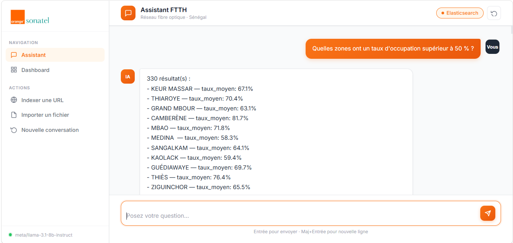
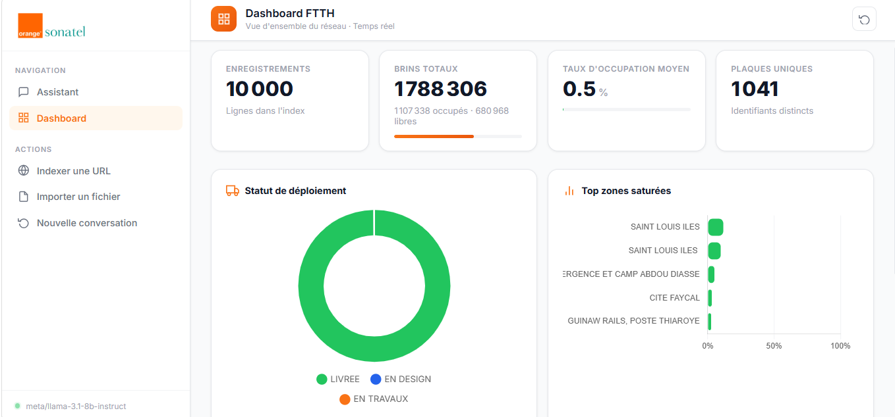

# 🔌 FTTH Assistant — RAG Chatbot Sonatel

> Assistant intelligent connecté à Elasticsearch, propulsé par NVIDIA NIM.  
> Permet d'interroger en langage naturel les données du réseau fibre optique FTTH de Sonatel.

**DSI — Direction des Systèmes d'Information · Orange Sonatel**

---

## 📸 Aperçu

### 🏠 Écran d'accueil — Catégories de questions


### 💬 Interface de chat


### 📊 Dashboard analytique


---

## 📌 Description

Ce projet est un assistant RAG (**Retrieval-Augmented Generation**) développé pour la DSI d'Orange Sonatel.  
Il permet aux équipes techniques d'interroger en langage naturel l'index Elasticsearch contenant les données du réseau FTTH (plaques, NRO, taux d'occupation, statuts de déploiement, etc.).

---

## 🚀 Fonctionnalités

| Fonctionnalité | Description |
|---|---|
| 💬 **Chat intelligent** | Questions en langage naturel traduites en requêtes Elasticsearch via LLM |
| 📊 **Dashboard** | KPIs temps réel : brins, taux d'occupation, statuts, régions, zones DRV |
| 🗂️ **Catégories** | 6 catégories de questions prédéfinies avec drawer interactif |
| 📄 **Import de documents** | Indexation de fichiers PDF/TXT et URLs dans FAISS |
| 🔍 **Double mode** | Mode Elasticsearch (données structurées) + mode FAISS (documents) |

---

## 🛠️ Stack technique

| Composant | Technologie |
|---|---|
| Langage | Python 3.11 |
| Backend | Flask 3.1 |
| LLM | NVIDIA NIM · `meta/llama-3.1-8b-instruct` |
| Embeddings | `all-MiniLM-L6-v2` (sentence-transformers) |
| Base vectorielle | FAISS |
| Source de données | Elasticsearch |
| Frontend | HTML · CSS · JavaScript · Chart.js |

---

## ⚙️ Installation

### 1. Cloner le projet

```bash
git clone https://github.com/TON_USERNAME/ftth-assistant.git
cd ftth-assistant
```

### 2. Créer l'environnement virtuel (Python 3.11 obligatoire)

```bash
py -3.11 -m venv .venv
.venv\Scripts\activate        # Windows
source .venv/bin/activate     # Linux / macOS
```

### 3. Installer PyTorch CPU en premier

```bash
pip install torch==2.6.0+cpu --index-url https://download.pytorch.org/whl/cpu
```

### 4. Installer les dépendances

```bash
pip install -r requirements.txt
```

---

## 🔧 Configuration

```bash
copy .env.example .env    # Windows
cp .env.example .env      # Linux / macOS
```

Remplir les variables dans `.env` :

| Variable | Description |
|---|---|
| `ES_URL` | URL du serveur Elasticsearch |
| `ES_INDEX` | Nom de l'index Elasticsearch |
| `ES_USER` | Utilisateur Elasticsearch |
| `ES_PASSWORD` | Mot de passe Elasticsearch |
| `NVIDIA_API_KEY` | Clé API NVIDIA NIM |
| `LLM_MODEL` | Modèle LLM (`meta/llama-3.1-8b-instruct`) |
| `FAISS_PATH` | Dossier de stockage FAISS (`./faiss_db`) |

---

## ▶️ Lancement

```bash
# Optionnel : indexer des documents dans FAISS
python ingest.py

# Lancer l'application
python app.py
```

Ouvre ensuite **http://localhost:5000**

---

## 📁 Structure du projet

```
Chatbot/
├── app.py                  # Serveur Flask + pipeline RAG
├── query_engine.py         # Traduction NL → requêtes Elasticsearch
├── ingest.py               # Ingestion ES / URL / PDF → FAISS
├── config.py               # Configuration centralisée
├── requirements.txt
├── .env.example            # Template de configuration
├── static/
│   ├── css/style.css       # Styles
│   ├── js/app.js           # Logique frontend
│   └── Logo sonatel.png    # Logo Sonatel
├── templates/
│   └── index.html          # Interface principale
└── faiss_db/               # Index vectoriel (auto-créé, non versionné)
```

---

## 🔄 Fonctionnement

```
Mode Elasticsearch (données structurées)
  Question → LLM → Requête ES → Résultats → Réponse

Mode FAISS (documents)
  Question → Embedding → Recherche FAISS → Contexte → LLM → Réponse
```

---

## 👤 Auteur

Développé par **MBONDO Debora Nichelvie** — Stagiaire à la DSI — Orange Sonatel  
© 2025 Orange Sonatel
